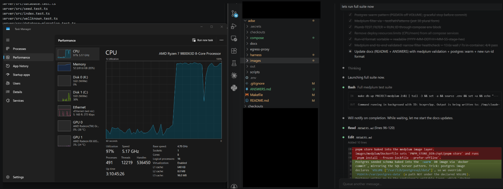

# Headless Agent Sandbox

Docker-based sandbox runtime for AI coding agents. Per-project Compose
profiles, snapshot-based reset, headless config, structured output.

## Contents

- [Lifecycle stages](#lifecycle-stages) — the four-stage table (Bootstrap / Cold / Warm / Incremental) with measured wall times
- [Two-stack lifecycle, visually](#two-stack-lifecycle-visually) — session-level flow diagram
- [What's here](#whats-here) — directory tree of the repo
- [Quickstart](#quickstart) — fastest path from clean checkout to first warm run
- [Agent loop — task-scoped iteration](#agent-loop--task-scoped-iteration) — `--task` flag, `iterations.jsonl`, memory dir
- [How it answers the brief](#how-it-answers-the-brief) — one-row-per-design-consideration mapping
- [CLI surface](#cli-surface) — `sandbox.py` subcommands
- [Egress allowlist (caveat)](#egress-allowlist-caveat) — tinyproxy + FQDN allowlist, why it's advisory
- [How I used AI on this exercise](#how-i-used-ai-on-this-exercise) — including the orchestration-tier pullback
- [Limitations](#limitations) — known caveats, including the medplum acceleration finding

For the long-form answers to the brief's 8 design considerations, see [ANSWERS.md](ANSWERS.md).

---

## Lifecycle stages

Five stages, distinguished by **when they happen**, **what's reused**, and
**what the agent sees**. Measurements are from the eshop project on this
machine (Linux 6.6 WSL2, Docker Desktop, .NET 10 SDK).

| Stage | When | Starts from | DB state | What the agent sees | Wall time | In-container |
|---|---|---|---|---|---|---|
| **Bootstrap** | Once per host (or after image change) | Empty Docker host | n/a — no DB yet | n/a — no sandbox running | minutes (image build, base SDK pull, NuGet warm) | n/a |
| **Cold** | First task on a fresh host, or after `make nuke` | Bootstrapped `:latest` images for both DB + workload | Empty — every EF migration runs against empty databases | Repo baked into image, no prior work | **70s** | 51s |
| **Warm start** | Per *session* (first agent iteration), after `make warmup` has committed `:warm` snapshots | `:warm` images (compiled `bin/obj`, NuGet cache, migrated DB schema) | Schema already applied | Same baked repo + pre-built artifacts | **51s** | 35s |
| **Warm + DB up, full suite** | Iterations 2..N, all 113 tests | DB still up, workload restarts from `:warm` | Schema applied | Workload restarts, DB stays warm; migrate skipped via `__EFMigrationsHistory` row count vs source migration count; app_start removed (eShop tests use `WebApplicationFactory`) | **29s** | **22s** |
| **Warm + DB up, narrow filter** *(agent-loop hot path)* | Same, but with `--filter "FullyQualifiedName~ClassName"` to scope tests | Same | Same | Test stage drops from 17s (113 tests) to 3s (2 tests in one class) | **16s** | **9s** |
| **Incremental** | Same as Warm + DB up but with `--source` overlay | `:warm` workload + agent's modified files rsync'd over the warm tree (preserving `bin/obj/.git`) | Schema applied | Agent's edits on top of warm tree; `dotnet build` only recompiles changed files | **~30s** unchanged content, **~38s** with a 1-file edit | ~22-30s |

The bright lines:

- **Bootstrap vs Cold** — bootstrap is `docker build` (produces an image); cold is `docker compose up` (produces a sandbox). Bootstrap amortizes across every cold run that follows.
- **Cold vs Warm** — both start a fresh sandbox; warm has pre-paid restore + build + migrate via `docker commit`. The DB's writable layer carries the migrated schema; the workload's writable layer carries `bin/obj`. Same isolation guarantee — full `down -v` between sessions.
- **Warm vs Warm + DB up** — the DB stack now has its own compose file ([compose/databases/eshop.yml](compose/databases/eshop.yml)) and its own compose project. The workload compose joins the DB's network as `external: true`. The CLI tears down only the workload between iterations; the DB stays up. Saves ~8s per iteration (SQL Server boot + healthcheck wait).
- **Warm + DB up vs Incremental** — the warm path replaces `/workspace/repo` with the baked source on every iteration (no carryover between agent edits). Incremental overlays the agent's host-side edits on top of the warm tree via `rsync --exclude='bin/' --exclude='obj/' --exclude='.git/'`, so the compiler reuses the warm `obj/` cache. `.git` is preserved — we never stomp the baked repo's history.

How it maps to the brief's design considerations:

- **Q3 (clean state — reset/rebuild without starting from scratch)** spans **Cold → Warm**: the warm snapshot is the *checkpoint to rewind to*. Schema-applied, NuGet-warm, build-warm. Reset for a full session = `make destroy` + `make db-up`; reset between iterations = automatic workload teardown via `compose down -v`.
- **Q5 (build performance / startup time strategy)** is the whole tiered story above. Headline numbers for the agent loop: **70s cold → 29s full-suite warm → 16s narrow-filter warm** (in-container work: **9s**, the rest is compose container create/destroy overhead). Hitting wall-time below 13s would require keeping the workload container persistent across iterations; deliberately rejected because it weakens per-iteration isolation (see ANSWERS.md Q5 table, "Persistent workload container" row).

## Two-stack lifecycle, visually

```
session start ─→ make db-up                                           (DB cold-starts once, ~6s)
                  │
                  ├──→ make run-test                                  (full suite, 113 tests)         29s
                  ├──→ sandbox run eshop test --filter "..."          (narrow, 1 test class)          16s
                  ├──→ make run-task TASK=fix SOURCE=~/work/eshop     (incremental, with overlay)     ~30s
                  ⋮
session end   ─→ make destroy                                         (workload + DB both torn down)
```

The DB compose project (`ai-harness-eshop-db`) and the workload compose
project (`ai-harness-eshop`) have independent lifecycles. The workload
joins the DB's network (`ai-harness-eshop-net`) as `external: true`.

---

> ⚠️ Below this point the document is the previous README content,
> updated for the two-stack lifecycle. Sections likely to consolidate
> or trim on review: Quickstart, CLI surface, How I used AI.

---

## What's here

```
adse/
├── compose/
│   ├── databases/
│   │   ├── eshop.yml                       # SQL Server (compose project: ai-harness-eshop-db)
│   │   ├── medplum.yml                     # Postgres + Redis (compose project: ai-harness-medplum-db)
│   │   └── medplum-postgres-init.sql       # provisions medplum_test DB + readonly role
│   ├── eshop.yml                           # eshop workload + egress-proxy, joins eshop DB's network as external
│   └── medplum.yml                         # medplum workload + egress-proxy, joins medplum DB's network as external
├── checkouts/                              # host-side source clones (gitignored)
│   ├── eshop/                              # github.com/NimblePros/eShopOnWeb (.NET 10)
│   └── medplum/                            # github.com/medplum/medplum (Node 22, npm monorepo)
├── images/
│   ├── eshop/
│   │   ├── Dockerfile                      # .NET 10 SDK + warm NuGet + dotnet-ef
│   │   ├── runner.sh                       # subcommand CLI: build/warmup/test/all; skip-migrate-when-current
│   │   ├── healthcheck.sh
│   │   └── dockerignore.template           # deposited at checkouts/eshop/.dockerignore at build time
│   ├── medplum/
│   │   ├── Dockerfile                      # Node 22 + npm + warm node_modules (monorepo)
│   │   ├── runner.sh                       # subcommand CLI; skip-seed-when-current; jest --testPathPatterns
│   │   ├── healthcheck.sh
│   │   └── dockerignore.template
│   └── medplum_tests_acceleration.png      # CPU graph: capped vs uncapped jest
├── harness/
│   └── sandbox.py                          # thin CLI over docker buildx + docker compose + docker commit
├── egress-proxy/                           # tinyproxy + FQDN allowlist (advisory; see Egress section)
├── scripts/                                # install-gvisor.sh, verify-gvisor.sh
├── out/                                    # per-run results, gitignored
│   ├── _placeholder/                       # bind-mount defaults (empty dir + per-run results dirs)
│   └── <project>/<task-id>/<run-id>/       # run-id format: 2026-05-17T01-14-53-test-434b1e
├── Makefile                                # ergonomic wrappers around harness/sandbox.py
├── README.md                               # (this file) lifecycle, optimization story, demo flow
├── ANSWERS.md                              # written answers to the brief's 8 design considerations
└── docs/
    ├── TASK_TEXT.md, *.pdf                 # the brief
    └── out-of-scope/                       # earlier orchestration explorations pulled back per the brief
```

No top-level `docker-compose.yml`. Per-project profiles are the unit of isolation; each project is further split into a long-lived DB stack and an ephemeral workload stack with independent lifecycles.

## Quickstart

### Prerequisites

- Docker Desktop (WSL2 backend) or native Docker, with `docker compose`
- Python 3 on PATH (the harness is a thin wrapper over `docker buildx` + `docker compose`)
- ~10 GB free disk (eshop's `:latest` image is ~5.4 GB; `:warm` adds a few hundred MB)
- `git`, `openssl`, `make`
- Internet access for the first build (NuGet/npm warm + base image pulls)

```bash
docker version && docker compose version && python3 --version
```

### Step 1 — Generate DB passwords (once per checkout)

```bash
make bootstrap
```

Writes `.env` with `MSSQL_SA_PASSWORD` (random) and `POSTGRES_PASSWORD=medplum`. Re-running is a no-op. `.env` is gitignored.

### Step 2 — Build the sandbox image (~minutes, once per project or after image changes)

```bash
make build PROJECT=eshop
```

What happens:
- Clones `github.com/NimblePros/eShopOnWeb` into `checkouts/eshop/` if it's missing
- `docker buildx build` produces `ai-harness-eshop:latest` (.NET 10 SDK + warm NuGet)

Swap `PROJECT=medplum` to build the Node 22 stack instead.

### Step 3 — Warm up (once per image, ~70s for eshop)

```bash
make warmup PROJECT=eshop
```

Cold-starts DB + workload one time, runs EF migrations + `dotnet build`, then `docker commit`s the result into `:warm` tags. Future runs restore from `:warm` instead of paying restore+build+migrate again.

### Step 4 — Start the long-lived DB (~6s)

```bash
make db-up PROJECT=eshop
```

DB stack stays up across iterations. Saves ~8s per iteration vs. cold-booting SQL Server every run.

### Step 5 — Run tests (your inner loop)

```bash
make run-test PROJECT=eshop          # full suite (113 tests), ~29s
```

Iterate as many times as you want — DB stays up. Results land under `out/eshop/<task-id>/<run-id>/result.json`.

Faster inner loop with a test filter (~16s):

```bash
python3 harness/sandbox.py run eshop test --filter "FullyQualifiedName~BasketServiceTests"
```

### Step 6 — Iterate on host-side edits (incremental)

```bash
make run-task PROJECT=eshop TASK=fix-health SOURCE=~/work/eshop
# edit ~/work/eshop/src/Web/Program.cs
make run-task PROJECT=eshop TASK=fix-health SOURCE=~/work/eshop   # rsync overlay, ~30-38s
make tasks-show PROJECT=eshop TASK=fix-health                     # iteration history
```

`--source` rsyncs your edits over the warm tree (preserving `bin/obj/.git`) so `dotnet build` only recompiles changed files. `iterations.jsonl` and `memory/` persist across runs for the same `TASK`.

### Step 7 — Tear down at end of session

```bash
make destroy PROJECT=eshop           # workload + DB both stopped, volumes wiped
```

Between sessions you can also `make db-down` alone to wipe DB state without losing the `:warm` image.

### Common follow-ups

| You want to… | Command |
|---|---|
| Refresh upstream source without rebuilding the image | `make refresh-source PROJECT=eshop` |
| See what's running | `make ps PROJECT=eshop` |
| Tail logs | `make logs PROJECT=eshop` |
| Drop into the sandbox | `python3 harness/sandbox.py exec eshop -- bash` |
| Start over from scratch | `make nuke` (removes images too) |
| List all tasks | `make tasks-ls` |

### Troubleshooting

- **`make build` fails on first run** — check `docker buildx version`; ensure Docker Desktop has ≥8 GB RAM allocated.
- **`make warmup` times out on SQL Server** — give Docker more memory; SQL Server needs ~2 GB just to boot.
- **`not a directory` on run** — a stale warm image baked `/memory` or `/workspace/src` as a file. Fix: `make nuke && make build && make warmup`.
- **Tests see stale DB state across iterations** — expected with the long-lived DB. Either write idempotent tests or `make db-down && make db-up` between iterations (loses the ~8s DB-warm speedup).

## Agent loop — task-scoped iteration

```bash
make db-up PROJECT=eshop                                          # once per session
make run-task PROJECT=eshop TASK=fix-health-endpoint SOURCE=~/work/eshop
# vim ~/work/eshop/src/Web/Program.cs
make run-task PROJECT=eshop TASK=fix-health-endpoint SOURCE=~/work/eshop  # incremental
make tasks-show PROJECT=eshop TASK=fix-health-endpoint            # iteration history
make destroy PROJECT=eshop                                        # end of session
```

Substrate-provided (not the agent):

| Mechanism | Purpose | Lifecycle |
|---|---|---|
| `--task <id>` | Scopes results; enables iteration log + memory dir | per agent reasoning loop |
| `out/<project>/<task>/iterations.jsonl` | Append-only iteration log (records `db_was_up` per row) | persists across `down -v` |
| `out/<project>/<task>/<run_id>/` | Per-iteration artifacts; `run_id` format is `YYYY-MM-DDTHH-MM-SS-<stage>-<6hex>` so directories sort chronologically and read at a glance | persists |
| `out/<project>/<task>/memory/` | Agent-writable scratchpad, mounted as `/memory` | persists |
| `--source <dir>` | Host source override; rsync'd onto `/workspace/repo` | per iteration |

Not provided: the agent's LLM context / prompts / reasoning, cross-task memory.

## How it answers the brief

| Topic | Answer |
|---|---|
| **DB conflict (SQL Server vs Postgres + Redis)** | Per-project compose with independent DB and workload stacks. Unique network namespace per project; zero cross-talk. |
| **Clean state** | `docker commit` after warmup captures `bin/obj` (workload container) **and** the migrated DB schema (sqlserver container, since `mcr.microsoft.com/mssql/server:2022-latest` declares no `VOLUME`, so `/var/opt/mssql` lives in the container's writable layer and gets snapshotted). Postgres has the opposite — its image *does* declare a VOLUME, so Postgres data lives on tmpfs and is wiped by `down -v`. Workload `down -v` between iterations; DB `down -v` only on `make destroy`. |
| **Headless execution** | `ACCEPT_EULA=Y`, `DOTNET_NOLOGO`, `DOTNET_CLI_TELEMETRY_OPTOUT`. No CLI prompts; everything via env. |
| **Output capture** | `runner.sh` writes `/results/result.json` with `{run_id, project, stage, status, exit_code, duration_s, stages: {name: {ok, duration_s, log}}, artifacts}`. Stable exit codes: 0=pass, 10=build_fail, 20=test_fail, 30=migrate_fail, 40=health_fail, 50=timeout, 60=infra, 70=patch_fail, 80=checkout_fail. |
| **Isolation** | `cap_drop` of dangerous caps (NET_ADMIN, NET_RAW, SYS_ADMIN, SYS_MODULE, SYS_PTRACE, SYS_TIME, MKNOD, AUDIT_WRITE, SYS_TTY_CONFIG) + `no-new-privileges:true`. Per-project network namespace. gVisor opt-in via `runtime: runsc`. |
| **Secrets** | DB passwords in `.env` (gitignored), substituted at compose-up. Never in code, never in images, never logged. Production swap: Vault / 1Password / AWS Secrets Manager. |
| **Resource limits** | Currently unconstrained — `deploy.resources.limits` removed during optimization (single-threaded jest transpile + babel was the bottleneck, not CPU caps). Easy to re-add per-service if multi-tenant noisy-neighbor pressure appears. |
| **Build cache** | NuGet baked into `:latest`; bin/obj + DB schema baked into `:warm` via `docker commit`. Incremental `dotnet build` via `--source` rsync overlay. Independent DB lifecycle so SQL Server boot cost is amortized across the session. |

## CLI surface

```
sandbox fetch-source <project>              clone upstream repo to checkouts/<project>/
                                            --refresh  git fetch + reset --hard
sandbox build    <project>                  docker buildx build (auto-clones source if missing)
sandbox warmup   <project>                  cold-up DB + workload, commit :warm tags
sandbox db-up    <project>                  bring up the DB stack (no-op if up)
sandbox db-down  <project>                  tear down DB stack
sandbox run      <project> <stage>          ensure DB up -> workload up -> exec runner.sh -> workload down
                                            <stage> ∈ build | test | all
                                            --snapshot warm|cold (default: warm)
                                            --task <id>      scope to a task (persistent memory)
                                            --source <dir>   host source override (incremental builds)
                                            --filter <expr>  dotnet test --filter expression (narrow test scope)
sandbox exec     <project> -- <cmd>...      ad-hoc exec into the running sandbox
sandbox destroy  <project>                  tear down workload AND DB
sandbox tasks    ls | show | memory         introspect iteration history
```

## Egress allowlist (caveat)

`egress-proxy/` ships tinyproxy + FQDN allowlist. **Advisory only** — only
code that honors `HTTP_PROXY` / `HTTPS_PROXY` routes through it; the
container netns has direct outbound. Setting `HTTP_PROXY` on the workload
broke .NET LibMan HTTPS-via-proxy negotiation, so the env-var injection
is disabled. For enforced egress: k8s `CiliumNetworkPolicy` with
`toFQDNs` allowlist, or netns iptables rules.

## How I used AI on this exercise

**Tools.** Claude Code as the primary pair; one fresh-instance Claude Sonnet review at the critical junction described below.

**What AI got right.** Dockerfile + compose + bash scaffolding (saved hours). Discovering eShopOnWeb specifics via `gh api`: .NET 10 (not 9), two DbContexts (`CatalogContext` + `AppIdentityDbContext`), the actual health-check paths (`/home_page_health_check`, `/api_health_check`). Catching the WSL2 / Docker Desktop bind-mount permission quirk. Debugging the silent exit-code bug where `execd` emits `execution_complete` for success but `error` for failures.

**Course correction.** The biggest one: AI happily designed an entire orchestration tier (Temporal + a Runtime Manager service + LangGraph + OpenSandbox) before I asked an independent reviewer to read the brief. The reviewer's critique:

**Things I'd do differently.** Read the brief into the conversation *as a constraint document* before letting AI propose architecture. Validate Medplum in lockstep with eShop. Bake demo evidence into the Makefile from day 1.

## Limitations

- **Image size** (eshop: ~5.4 GB). Driven by .NET 10 SDK. Could shrink with multi-stage builds for pure runtime images, but the agent runs `dotnet test` inside — SDK has to be in.
- **Single host.** CLI calls local `docker`. For fleets: `DOCKER_HOST` or move to k8s.
- **Sequential default.** One run per project at a time. Parallel runs need unique compose project names.
- **medplum**: validated end-to-end. Narrow-filter test iteration: **~14s wall / ~7s in-container** (4 healthcheck tests). Full suite: **~1m28s wall** (3237/3364 tests pass; remaining 127 are medplum-specific Redis-password / role-grant config issues, not infrastructure).

  **What drove the 17min → 1m28s drop (≈12× speedup) was unblocking the DB I/O bottleneck.** Medplum's test suite makes thousands of small Postgres round-trips (transaction commits, fixture inserts/deletes, repository queries). With Postgres data on Docker Desktop's overlay2 writable layer on WSL2, every commit and fsync was hitting the WSL2 VM's emulated disk path — many small writes were the actual bottleneck, not CPU. Moving Postgres data effectively into RAM (the `:warm` baked seed sitting in the OS page cache, plus the writable layer Docker keeps hot during the container's life) collapsed those latencies and let jest finally saturate the cores it had been waiting on.

  Two changes together flipped the bottleneck story:

  1. **Postgres `:warm` pattern (the RAMDISK-equivalent for the DB)** — `seed.test.ts` runs ONCE at `warmup`, populates `medplum_test` with ~600 MB of schema + fixtures, and that state is captured into the `:warm` image via the `PGDATA`-off-`VOLUME` trick (see ANSWERS Q2). Every subsequent `db-up` starts already-seeded in ~4s, the page cache stays warm across the test stage, and Postgres queries hit RAM speeds instead of going through WSL2's disk emulation on every commit. Without this, every full-suite run is disk-bound on the DB.
  2. **Removing the `cpus: "2"` cap** — once the DB-I/O wait was gone, jest workers could actually use the CPU they had. medplum's test transpilation is babel-jest, single-threaded per worker. Capped at 2 cores, jest could only spawn ~2 workers; uncapped, jest fans out across the 16 cores. The CPU graph below makes this visible.

  *Host CPU during medplum's full test suite. Left: DB on disk + 2-core cap, jest pinned at ~12% (waiting on DB I/O, can't even use its 2 cores fully). Right: DB on RAM (via `:warm` page-cache hot path) + cap removed, jest fans out across cores. The disk-bound DB was the primary bottleneck; the CPU cap was the secondary one that only became visible once the first was unblocked.*

  
- **Container runs as root on WSL2** due to Docker Desktop's bind-mount perm quirk. Mitigated by `cap_drop` + `no-new-privileges` + per-project netns + (optional) gVisor. On native Linux, drop to uid 1001.
- **`/memory` and `/workspace/src` are pre-created as directories in the image** to avoid a Docker Desktop WSL2 cache-poisoning issue: if `docker commit` runs while those paths are bind-mounted to `/dev/null`, the warm image bakes them as zero-byte files, and subsequent runs that try to bind a real directory there fail with `not a directory` at OCI init. Pinning the rootfs entry type avoids it.
- **DB state leaks between iterations.** With the independent DB lifecycle, schema is reset only on `make destroy`. Tests that mutate state may see prior iteration's data. Mitigation: tests should clean up (eShop's xUnit tests are mostly idempotent), or `make db-down && make db-up` between iterations (loses the DB-warm speedup).
